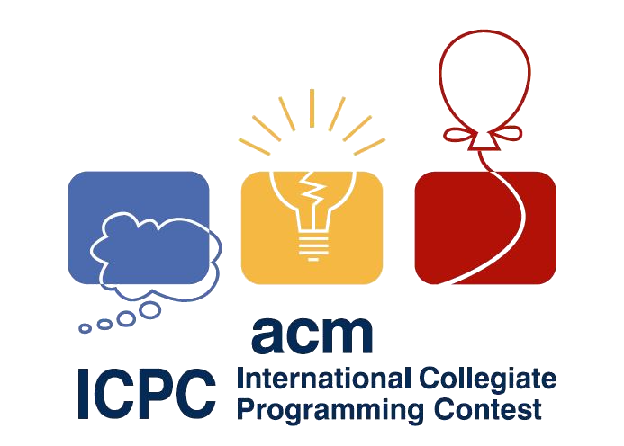

## CSUF-ICPC-Practice
---

---

Some practice from the ICPC teams at CSUF.

Solved:
* 8178-Latin-Squares (Justin, py3)

Resources:
* [ICPC Archives w/ Judge](https://icpcarchive.ecs.baylor.edu/index.php?option=com_onlinejudge&Itemid=9)
